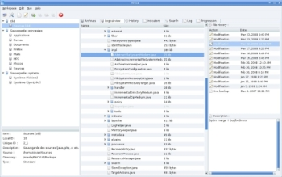

# Areca Backup

[Download](https://sourceforge.net/projects/areca-backup/files/)

> **:warning: `areca-backup.org` :warning: is no longer the official site at least for this Areca fork.**

Areca Backup basically allows you to select a set of files / directories to backup,
choose where and how (as a simple file copy or as a zip archive) they will be stored,
and configure post-backup actions (like sending backup reports by email or launching custom shell scripts).

It has been designed to ?

- ***Be as simple as possible to set up*** : 
  No complex configuration files to edit 
  Your backup configuration (stored as an XML file)
  can be edited with Areca's graphical user interface.

- ***Be as versatile as possible*** : 
  Areca can use advanced backup modes (like *delta backup*)
  or simply produce a basic copy of your source files as a standard directory
  or zip archive.

- ***Allow you to interact with your archives*** : 
  Browse your archives, track and recover a specific version of a file,
  merge a set of archives into a single one, etc.

[Screenshots](docs/user/screenshots.md)

## Table Of Content

- [Main features](#main-features)
- [Documentation](#documentation)
  - [End user documentation](#end-user-documentation)
  - [Technical informations](#technical-informations)
  - [Documentation for developers](#documentation-for-developers)

## Main features

- [Multiplatform](docs/user/documentation.md#how-to-install-areca-)
- [Compression](docs/user/documentation.md#compression) (Zip & Zip64).
- [Encryption](docs/user/documentation.md#encryption) (AES128 & AES256).
- [Storage](docs/user/documentation.md#target-settings)
  on local hard drive, SSD, NVMe, network drive, USB drive, FTP, FTPs or SFTP server.
- [File filters](docs/user/documentation.md#file-filters)
  (by extension, subdirectory, regular expression, size, date, status, with AND/OR/NOT logical operators).
- [Incremental, differential and full backup](docs/user/documentation.md#backup-types) support.
- Support for [delta backup](docs/user/documentation.md#storage-modes).
- [ACL](docs/user/faq.md#acl-and-extended-attributes-support-)
  and Extended attributes support (Linux only)
- Support several [languages](docs/user/documentation.md#translations)
  (br, cn, cs, da, nl, sv, tw, de, en, es, fr, hu, it, ja, pt, ru).
- Archives [merges](docs/user/documentation.md#merge).
- As of date [recovery](docs/user/documentation.md#how-to-recover):
  Areca allows you to recover your archives (or single files) as of a specific date.
- [Transaction mechanism](docs/user/features.md#backup-engine-features-).
- Backup [reports](docs/user/documentation.md#prepost-processing)
  (disk or [email](docs/user/images/linux/original/email.jpg)).
- Pre and Post backup [scripts](docs/user/documentation.md#prepost-processing).
- Files [permissions](docs/user/documentation.md#files-management),
  [symbolic links](docs/user/documentation.md#file-filters)
  and named pipes can be stored and recovered (Linux only).
- Backup [Wizards](docs/user/documentation.md#using-the-wizards)
- [Plugins](docs/user/documentation.md#extending-areca).
- [CLI](docs/user/documentation.md#command-line-interface)
  (Command-Line Interface)
- [GUI](docs/user/documentation.md#gui)
  ([Graphical User Interface](docs/user/screenshots.md "Screenshots"))
    - [Archives content explorer](docs/user/images/linux/original/physical_view.jpg).
    - [File version tracking](docs/user/images/linux/original/logical_view.jpg)
      (creation / modifications / deletion).
    - [Archive description](docs/user/images/linux/original/detail_properties.jpg).
    - [Backup simulation](docs/user/images/linux/original/simulation.jpg).
    - [User's actions history](docs/user/images/linux/original/history.jpg)
      (archives deletion, merges, backups, recoveries).
    - Areca takes the look and feel of the underlying operative system.

## Documentation

### End user documentation

- [Tutorial](docs/user/tutorial.md)
  1. [Configuring your first target](docs/user/tutorial1.md)
  2. [Running your first backup](docs/user/tutorial2.md)
  3. [Recovering files from your archives](docs/user/tutorial3.md)
  4. [Merging your archives](docs/user/tutorial4.md)
  5. [Recovering files when your backup configuration has been lost](docs/user/tutorial5.md)
- [User's manual](docs/user/documentation.md)
  - [What is Areca?](docs/user/documentation.md#what-is-areca-)
  - [What is NOT Areca?](docs/user/documentation.md#what-is-not-areca-)
  - [Why use Areca?](docs/user/documentation.md#why-use-areca-)
  - [User interfaces](docs/user/documentation.md#user-interfaces)
  - [How to install Areca?](docs/user/documentation.md#how-to-install-areca-)
  - [Basic concepts](docs/user/documentation.md#basic-concepts)
  - [Target settings](docs/user/documentation.md#target-settings)
  - [Archive management](docs/user/documentation.md#archive-management)
  - [Using the graphical user interface](docs/user/documentation.md#using-the-graphical-user-interface)
  - [Using the command-line interface](docs/user/documentation.md#using-the-command-line-interface)
  - [How to recover](docs/user/documentation.md#how-to-recover)
  - [Scheduling](docs/user/documentation.md#scheduling)
- [FAQ](docs/user/faq.md)

### Technical informations

- [Regular expressions](docs/user/regex.md)
- [Translations](docs/user/documentation.md#translations)
- [Extending Areca](docs/user/documentation.md#extending-areca)
- [Config backup](docs/user/config_backup.md)

### Documentation for developers

- [Development environment](docs/developer/development-environment.md)
- [Build Areca Backup](docs/developer/building.md)

---

Mirrors of no longer available [**documentation**](https://bugtamer.github.io/areca-backup-legacy-documentation/) from:
- [areca-backup.org](https://bugtamer.github.io/areca-backup-legacy-documentation/areca-backup.org/) (Olivier PETRUCCI's Areca official site, no the current one)
- [arecavss.com](https://bugtamer.github.io/areca-backup-legacy-documentation/arecavss.com/)
  (Volume Shadow Copy plugin)
