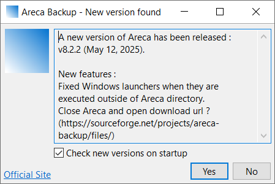

# Areca Backup - Check for new version ...

1. From TUI, run one of:
   - areca-backup> `areca_check_version.bat`
   - areca-backup$ `./areca_check_version.sh`
   ")
2. From GUI:
   - Click on `Help` menu
   - Click on `Check for new version ...` option.
   

Both verify the existence of a new version as follows:

**Request**

```http
GET https://areca-backup.sourceforge.io/version_xml.php HTTP/1.1
content-type: application/xml
```

**Pattern response**

```xml
<?xml version="1.0" encoding="UTF-8"?>
<versiondata
    id="x.y.z"
    date="yyyy-mm-dd"
    url="https://sourceforge.net/projects/areca-backup/files/"
    description="Change log"
/>
```

- `id` last released version ([Semantic Versioning](https://semver.org/))
- `yyyy-mm-dd` release date. `mm` is one-based month (1-12).
- `url` download URL
- `description` change log

`version_xml.php` returns `areca-backup/`[`version.xml`](../../../../../version.xml),
that was uploaded at the time of deploying a new release to the `sourceforge` server.


[Make a test call to `Check for new version ...`](../../../../../test/check-for-new-version.http).

The URL to call is defined in
[`ArecaURLs.java`](../../../../../src/com/application/areca/ArecaURLs.java) (`BASE_URL` + `VERSION_URL`).


## Relevant files

### TUI 

- [Launchers](../../../launchers.md)
  - [`areca_check_version.bat`](../../../../../areca_check_version.bat)
  - [`areca_check_version.sh`](../../../../../areca_check_version.sh)
- Initial Java class
  - [`VersionCheckLauncher.java`](../../../../../src/com/application/areca/version/VersionCheckLauncher.java)

### GUI

- [`Application.java`](../../../../../src/com/application/areca/launcher/gui/Application.java)
  - See `checkVersion()` that launches version window
- [`VersionData.java`](../../../../../src/com/myJava/util/version/VersionData.java)
  - `isGreaterThanOrEqualsTo()` compares Versions as ordinals.
  - `versionToOrdinal()` converts `x.y.z` into an ordinal number.
- [`Utils.java`](../../../../../src/com/application/areca/Utils.java)
  - `addRightPadding()`: converts each part of `x.y.z` to a fixed-length number.
- [`ArecaURLs.java`](../../../../../src/com/application/areca/ArecaURLs.java)
  - Defines the URL to check to find out if there is a new release.


## Fix commit

- Title: `fix "Check for new version ..." feature and broken links`
- Date: 2024-06-29
- Hash: `c645d48b57a511aac87550eae0c5b73b962de864`


## Related topics

- [Release version checklist](../../../release-version-checklist.md)
- Fork Areca repo
- [Version history](../../../history.md)
- [Launchers](../../../launchers.md)
- UI-links
- Icons