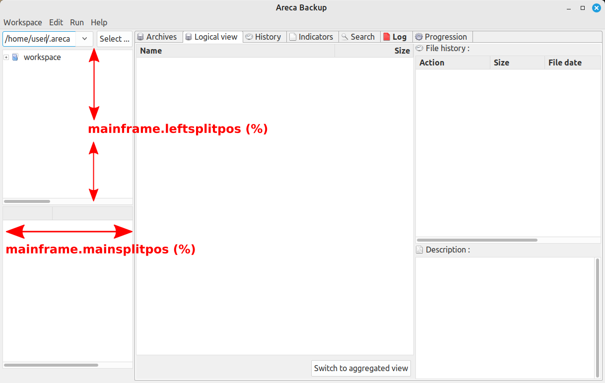

# Areca Backup - preferences.properties

`preferences.properties` sample:

```properties
#Areca user preferences
#Thu May dd hh:mm:ss CEST yyyy
mainframe.x=319
ws.history.0=C\:/Users/user/.areca/workspace
startup.workspace=
lastworkspace=C\:/Users/user/.areca/workspace
startup.display.logical.view=false
info.channel.synthetic=true
mainframe.width=1920
launch.count=1
mainframe.leftsplitpos=70
check.new.versions=false
archive.displayreport=false
editor.text=
mainframe.mainsplitpos=30
archive.storage=
display.toolbar=true
mainframe.height=1017
dnt.msg.day=9170
startup.mode=last
mainframe.maximized=false
display.ws.address=true
file.size.prefix=binary
mainframe.y=392
date.format=
lang=en
```


## UI properties

- `startup.display.logical.view`=`false`
- `archive.displayreport`=`false`
- `display.toolbar`=`true`
  Show or hide the button bar.
- `info.channel.synthetic`=`true`
- `lang`=`en`
  GUI language.
- `file.size.prefix`=`binary` (default)
  - `binary`  1024 bytes = kibibyte = 1 kiB
  - `decimal` 1000 bytes = kilobyte = 1 kB
  - Feature available since v8.2.0. Requires restart Areca.
    See *Now "Preferences" allows you to change how file sizes are displayed (decimal or binary)* commit (2024-11-30).
- `date.format`= (empty by default)
  See [DateTimeFormatter - Patterns for Formatting and Parsing](https://docs.oracle.com/javase/8/docs/api/java/time/format/DateTimeFormatter.html#patterns) for more details.


## Behaviour properties

- `startup.mode`=`last`
- `check.new.versions`=`false`
  Indicates whether Areca will check on startup to see if a new version is available.
- `editor.text`=
- `launch.count`=`1`
  Number of times Areca has been executed.
- `dnt.msg.day`=`9170`
  Donation message day.
  See [GUIDonationHelper.java](../../src/com/application/areca/launcher/gui/donation/GUIDonationHelper.java).
- `archive.storage`=
- `log.level=4`
  - `1` Errors
  - `2` Warnings
  - `3` Informations
  - `4` Details
  - `5` Most detailed


## Worksapce properties

- `ws.history.0`=`$USER/.areca/workspace`
- `startup.workspace`=
- `lastworkspace`=`$USER/.areca/workspace`
- `display.ws.address`=`true`
  Show or hide the workspace selector.


## Dimensions and coordinates of the Window

- `mainframe.x`=`319`
  Sets the distance, in pixels, of the Areca window from the left side of the screen.
- `mainframe.y`=`392`
  Sets the distance, in pixels, of the Areca window from the top of the screen.
- `mainframe.width`=`1920`
  Sets the width, in pixels, of the Areca window.
- `mainframe.height`=`1017`
  Sets the height, in pixels, of the Areca window.
- `mainframe.maximized`=`false`
  Sets the window to initially start maximized (`true`) or in windowed mode (`false`).
- `mainframe.leftsplitpos`=`70`
  Percentage of the height of the left panel (top subpanel).
- `mainframe.mainsplitpos`=`30`
  Percentage of the width of the left panel.
  
