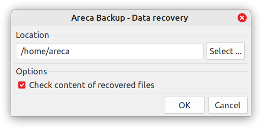
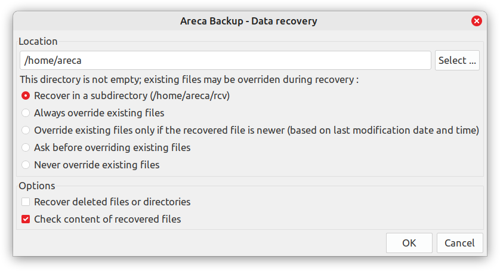

# Areca Backup - Recover Dialogs

There are two ***Areca Backup - Data recovery*** dialogs:

1. For recovering a single entry of an archive (*[simple mode](#simple-mode)*):

   

2. For recovering an entire archive (*[full mode](#full-mode)*):

   

Both are implemented in
[`RecoverWindow.java`](/src/com/application/areca/launcher/gui/RecoverWindow.java):

```Java
/**
    * FullMode controls the display : 
    * <BR>true for full options (when recovering an entire archive)
    * <BR>false for simple mode (when recovering a single entry)
    * @param fullMode
    */
public RecoverWindow(boolean fullMode) {
    this.fullMode = fullMode;
}
```

Dialog screens are instantiated and triggered from the `processCommand()` method in
[`Application.java`](/src/com/application/areca/launcher/gui/Application.java),
in order to collect user preferences related to the recovery process, such as
the destination path ***Location*** or ***Check content of recovered files***.
After the dialog screen is closed, the recovery process continues within `processCommand()`:

```Java
public void processCommand(final String command);
```

The `command` argument should match a specific static member of
[`ActionConstants.java`](/src/com/application/areca/launcher/gui/common/ActionConstants.java).


Dialogs' labels and tooltips (`.tt`) start with `recover.` in
[`resources_en.properties`](/translations/resources_en.properties).


## Simple mode

- From the ***Logical view*** tab:

  1. ***File history*** panel <br>
     (which includes the columns: ***Action***, ***Size***, ***File date***, and ***Backup date***)
  2. Right-click on any file
  3. Choose the ***Recover ...*** context menu option

- From
  [`ActionConstants.java`](/src/com/application/areca/launcher/gui/common/ActionConstants.java)
  in the `processCommand()` method of
  [`Application.java`](/src/com/application/areca/launcher/gui/Application.java):

  1. `CMD_RECOVER_ENTRY_HISTO`
  2. `CMD_VIEW_FILE_AS_TEXT_HISTO`
  3. `CMD_VIEW_FILE_HISTO`
  4. `CMD_VIEW_FILE_AS_TEXT`
  5. `CMD_VIEW_FILE`

  ```Java
  RecoverWindow window = new RecoverWindow(false);
  ```


## Full mode

- From the ***Run*** menu (you must first selected an archive in the ***Archives*** tab):

  1. Click on the ***Recover ...*** menu option

- From the ***Archives*** tab:

  1. Right-click on the target archive
  2. Choose the ***Recover ...*** or ***Archive detail ...*** context menu option

- From the ***Archive detail***:

  1. ***Archive content*** tab
  2. Right-click on any file or directory
  3. Choose the ***Recover ...*** context menu option

- From the ***Logical view*** tab:

  1. Right-click on any file or directory <br>
     (in the panel that has ***Name*** and ***Size*** columns)
  2. Choose the ***Recover ...*** context menu option

- From
  [`ActionConstants.java`](/src/com/application/areca/launcher/gui/common/ActionConstants.java)
  in the `processCommand()` method of
  [`Application.java`](/src/com/application/areca/launcher/gui/Application.java):

  1. `CMD_RECOVER`
  2. `CMD_RECOVER_WITH_FILTER`
  3. `CMD_RECOVER_WITH_FILTER_LATEST`

  ```Java
  RecoverWindow window = new RecoverWindow(true);
  ```
