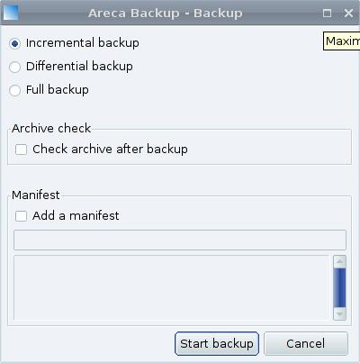
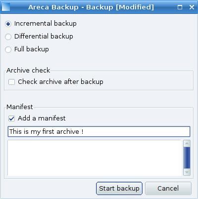
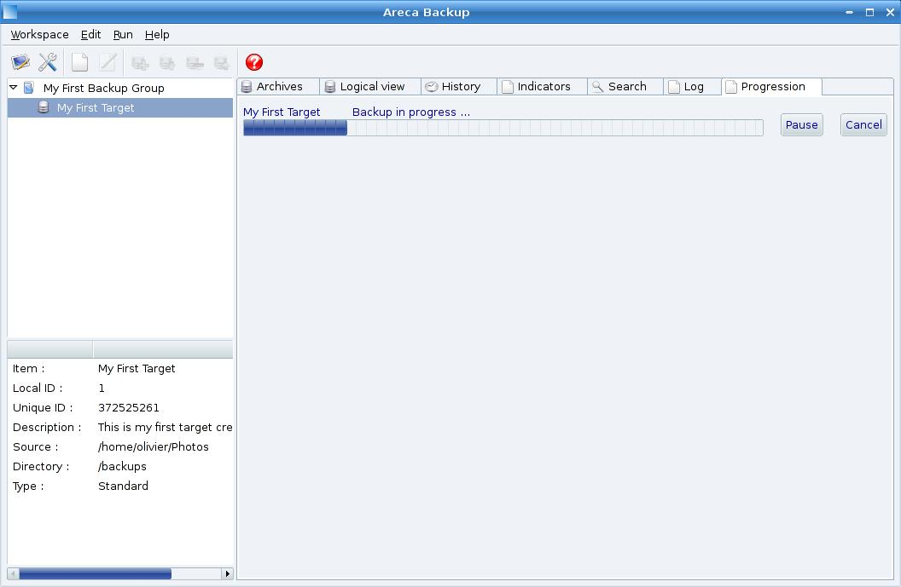
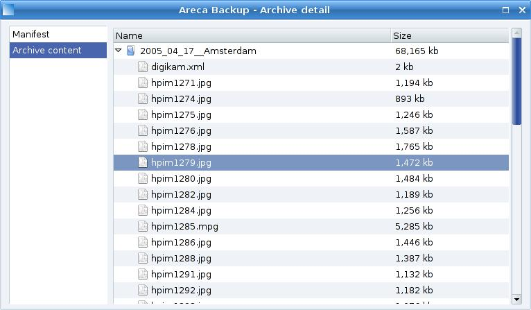
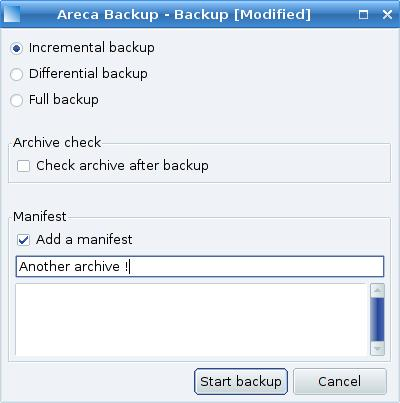
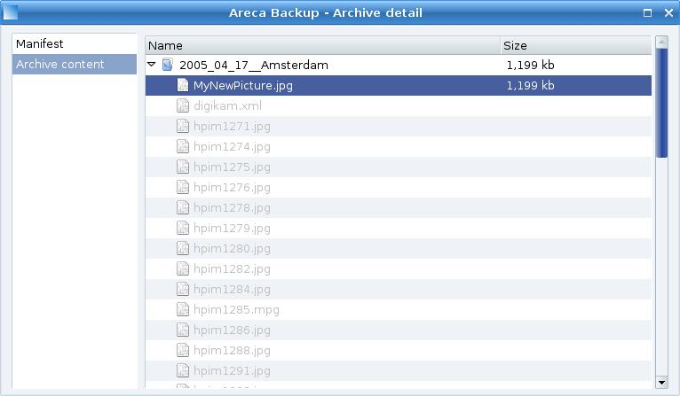

# Areca Backup - Tutorial: Running your first backup

| About Areca                   | End user documentation            | Technical informations                        |
|-------------------------------|-----------------------------------|-----------------------------------------------|
| [Home](README.md)             | [Plugins](plugin_list.md)         | [Regular expressions](regex.md)               |
| [Features](features.md)       | [Versions history](history.md)    | [Translations](documentation.md#translations) |
| [Plugins](plugin_list.md)     | [Tutorial](tutorial.md)           | [Config backup](config_backup.md)             |
| [Screenshots](screenshots.md) | [User's manual](documentation.md) |                                               |
| [Download]                    | [FAQ](faq.md)                     |                                               |
| [Bug & feature requests]      | [Support & Contact](support.md)   |                                               |
| [Forums]                      |                                   |                                               |

[Download]: https://sourceforge.net/projects/areca/files/areca-stable/
[Bug & feature requests]: https://sourceforge.net/p/areca/_list/tickets?source=navbar
[Forums]: https://sourceforge.net/projects/areca/forums

> This short tutorial will show you how to run your first target.
>
> Make sure you've had a look at the previous tutorial before reading this section.
>
> You can also have a look at the "User's Manual" section for more informations.

"[Tutorial](tutorial.md)" section

## Before starting

It is assumed that you've installed Areca using the default procedure of your system (Linux or Windows).
Make sure you've had a look at the previous tutorial (Section 1 : "[Configuring your first target](tutorial1.md)") before reading this section.

## Launching your first backup

Once your target has been created (see tutorial section 1 : "[Configuring your first target](tutorial1.md)"), you can run it as frequently as you want : select your target in the left side of the main window :

... right click and and hit the "`Backup`" item in the menu that appears.

A new window appears and asks some (optional) informations about the backup that will be performed :

We want to provide a short description for this first backup, so select the "`Add manifest`" checkbox and enter "`This is my first archive !`" as title.

Once you're done, hit the "`Start Backup`" button : the window closes and a progress bar appears in the main window :

## Viewing your archive

Once the backup is completed, your new archive appears in the "`Physical view`" tab ... that's it : you've created your first archive with Areca Backup !

You can see the content of your archive by double-clicking on it :

## Performing another backup

Let's suppose that you add a new picture (named "`MyNewPicture.jpg`") in your directory. If you want to backup this new file, all you have to do is to select your target again, right click and select "`Backup`" again (as shown previously)

Enter "`Another archive !`" as archive title and hit "`Start Backup`"

Once the backup is finished, you can notice that another row appears in your "`Physical view`" tab. This is your new archive.

Double-click on it to see its content :

You can notice that it only contains the new file (all other files are greyed). This is called "`Incremental backup`" : Areca only stores new or modified files.

## Viewing a file's history

Let's assume that the new picture ("`MyNewPicture.jpg`") has been modified and that a third backup has been performed :

Go the "`Logical view`" tab :
If you select the "`MyNewPicture.jpg`" item, you can see its history on the right side of the tab.

In this example, you see that the file was created at 9:50 PM and modified at 9:54 PM.

## Next step ...

Step 3 : [Recovering files from your archives](tutorial3.md)

---

[Top] | [Copyright (c) 2005-2015 Olivier PETRUCCI]

[Top]: #areca-backup---tutorial-running-your-first-backup "Go to top of the document"
[Copyright (c) 2005-2015 Olivier PETRUCCI]: https://bugtamer.github.io/areca-backup-legacy-documentation/areca-backup.org/tutorial2.html "Visit a legacy copy of the original resource that is no longer available"