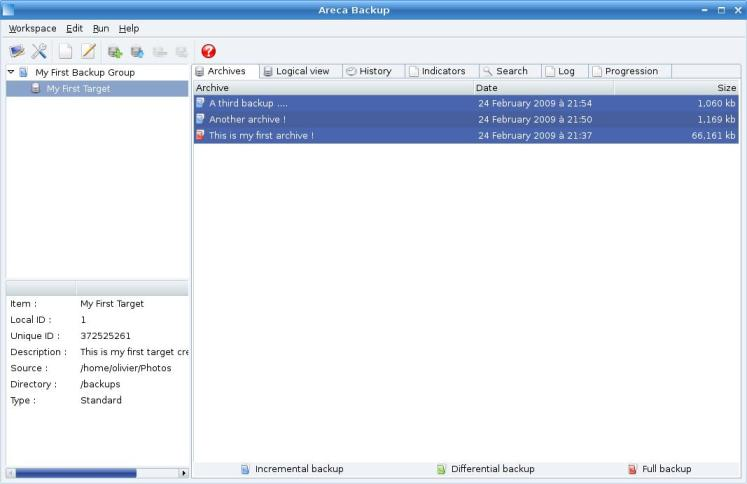
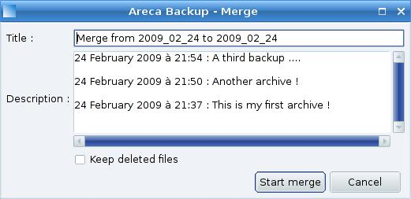
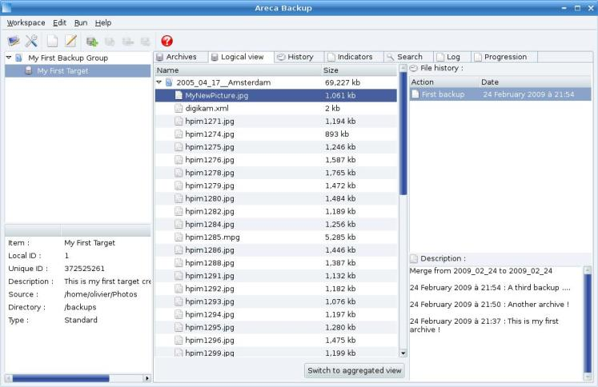

# Areca Backup - Tutorial: Merging your archives

| About Areca                   | End user documentation            | Technical informations                        |
|-------------------------------|-----------------------------------|-----------------------------------------------|
| [Home](README.md)             | [Plugins](plugin_list.md)         | [Regular expressions](regex.md)               |
| [Features](features.md)       | [Versions history](history.md)    | [Translations](documentation.md#translations) |
| [Plugins](plugin_list.md)     | [Tutorial](tutorial.md)           | [Config backup](config_backup.md)             |
| [Screenshots](screenshots.md) | [User's manual](documentation.md) |                                               |
| [Download]                    | [FAQ](faq.md)                     |                                               |
| [Bug & feature requests]      | [Support & Contact](support.md)   |                                               |
| [Forums]                      |                                   |                                               |

[Download]: https://sourceforge.net/projects/areca/files/areca-stable/
[Bug & feature requests]: https://sourceforge.net/p/areca/_list/tickets?source=navbar
[Forums]: https://sourceforge.net/projects/areca/forums

> This short tutorial will show you how to use the "merge" feature of Areca.
>
> Make sure you've had a look at the previous tutorials before reading this section.
>
> You can also have a look at the "User's Manual" section for more informations. 	"Tutorial" section

"[Tutorial](tutorial.md)" section

## Before starting

It is assumed that you've installed Areca using the default procedure of your system (Linux or Windows).

Make sure you've had a look at the previous tutorial (Section 3 : "[Merging your archives](tutorial3.md)") before reading this section.

## Merging archives

If you want to keep only a limited number of archives to avoid using too much space on your backup location, the "merge" feature will be useful to you.

Go to the "`Physical view`" and select your three archives :

Right-click and select the "`Merge`" menu item :

A new window appears :

Just hit the "`Start merge`" button.
Once the merge is performed, you can notice that only one archive appears in the "`Physical view`" :

Double-click on it to see its content : you can notice that all files (including "`MyNewPicture.jpg`") are contained in this unique archive :

If you go back to the "`Logical view`" and select "`MyNewPicture.jpg`", you see that the file's history has disappeared. A unique version is now displayed (created at 9:54 PM) : Areca has destroyed the file's history and kept the last version only.

## Next step ...

Step 5 : [Recovering files when your backup configuration has been lost](tutorial5.md)

---

[Top] | [Copyright (c) 2005-2015 Olivier PETRUCCI]

[Top]: #areca-backup---tutorial-merging-your-archives "Go to top of the document"
[Copyright (c) 2005-2015 Olivier PETRUCCI]: https://bugtamer.github.io/areca-backup-legacy-documentation/areca-backup.org/tutorial4.html "Visit a legacy copy of the original resource that is no longer available"